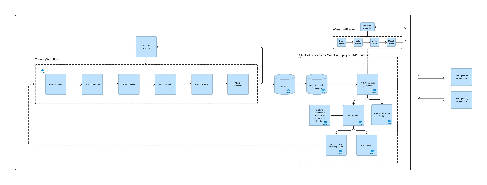
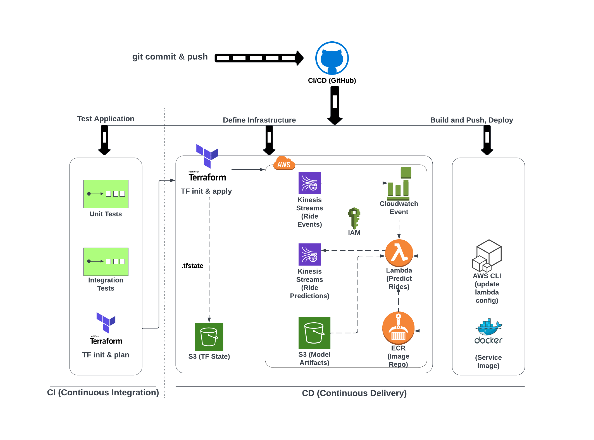
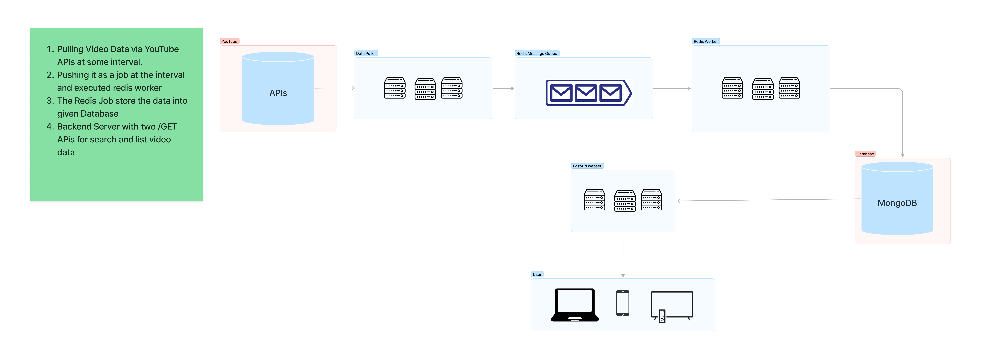
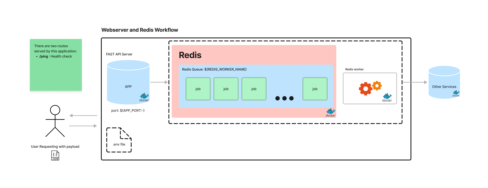
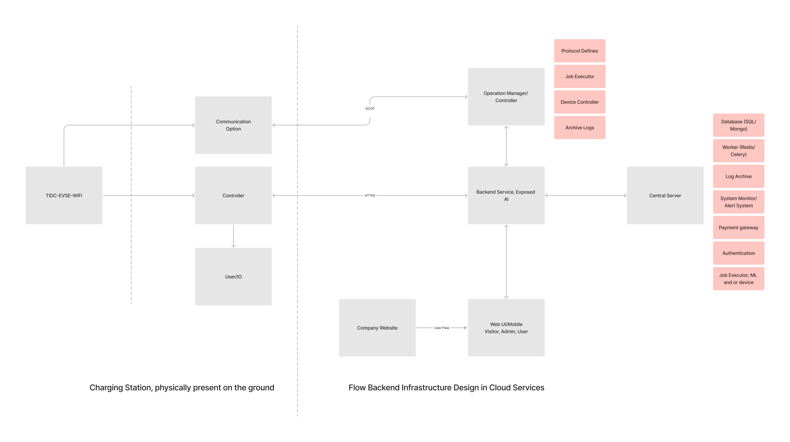
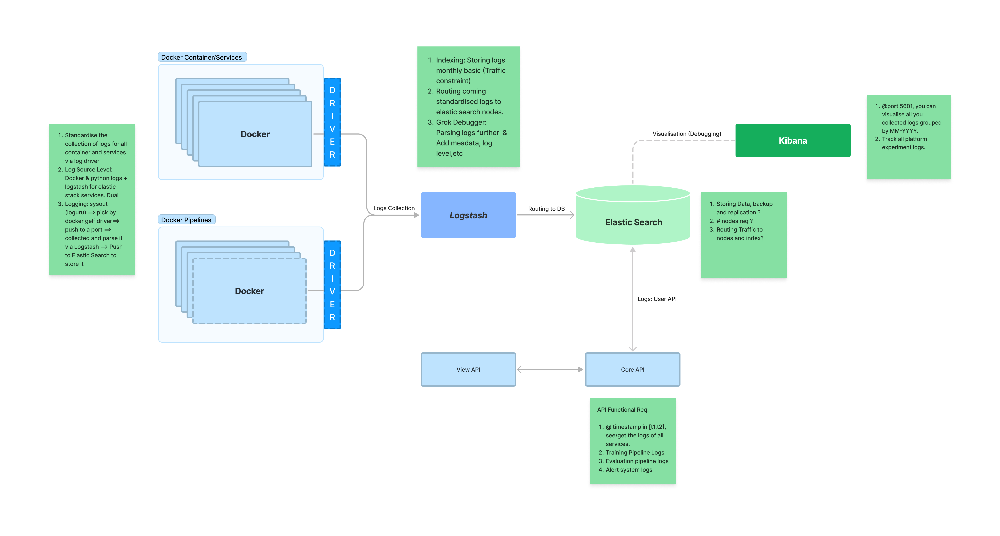
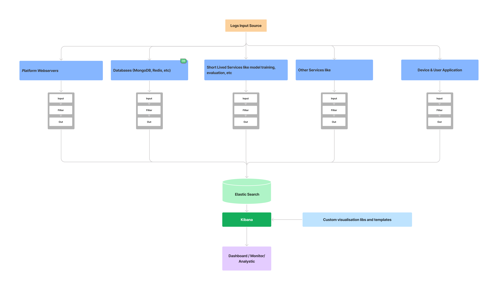
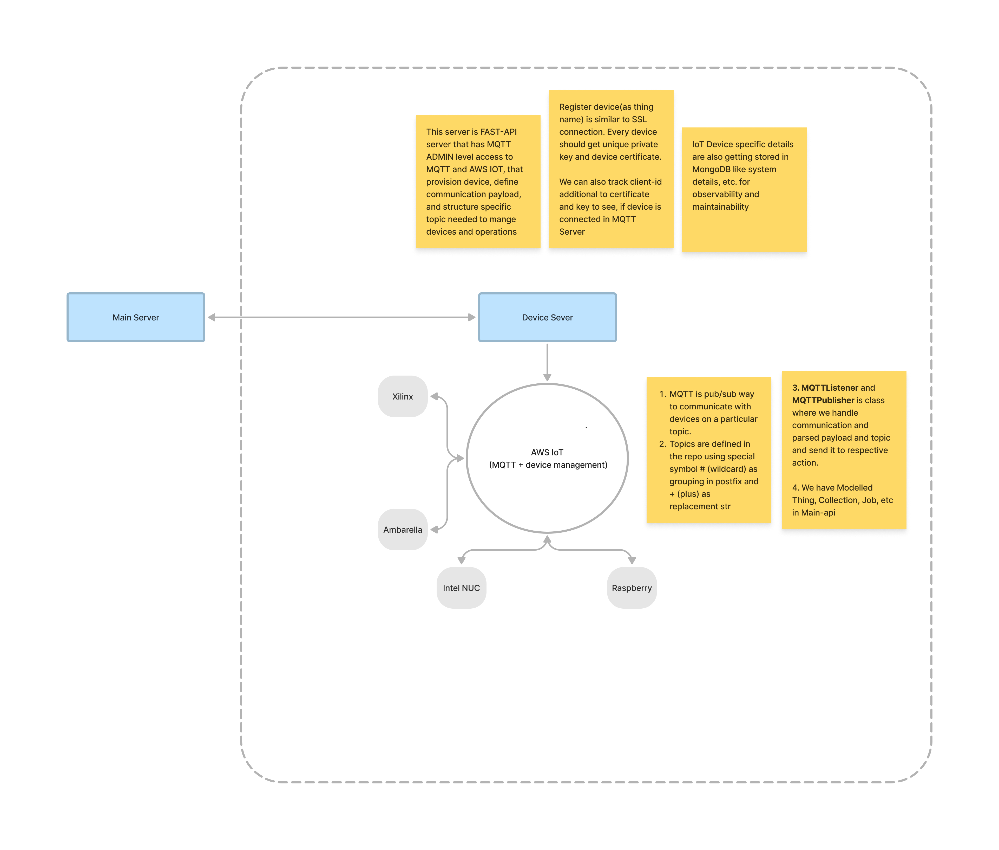
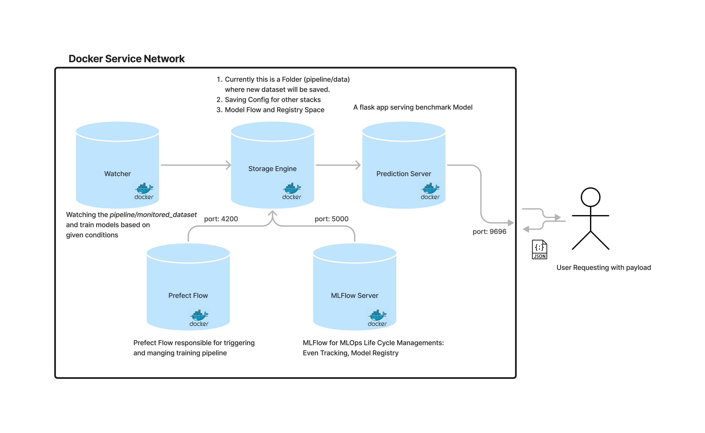
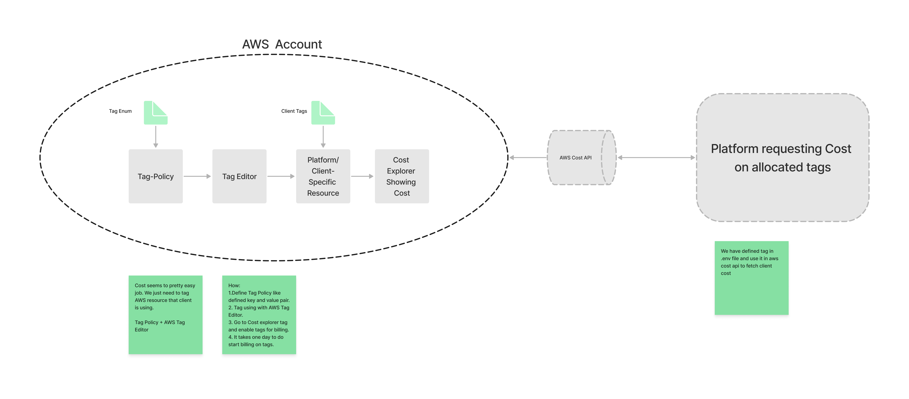

## System Design of My Past Projects

### MLOps and ML Life Cycle system

### CI/CD Pipeline

### Event Driven : FastAPI + frontend + MongoDB + External API

### Designing Redis, worker and its job 

### Battery Charging System

### Log Archiving System

### Managing IoT Devices

### Docker Compose: Watcher, Prefect and Database for Automated Trigger

### Platform Cost Allocation System

